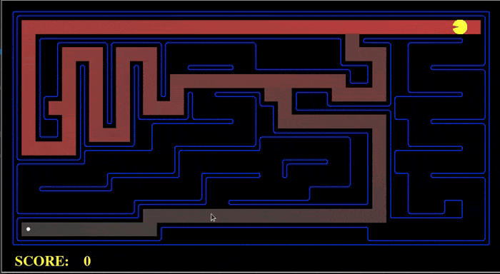
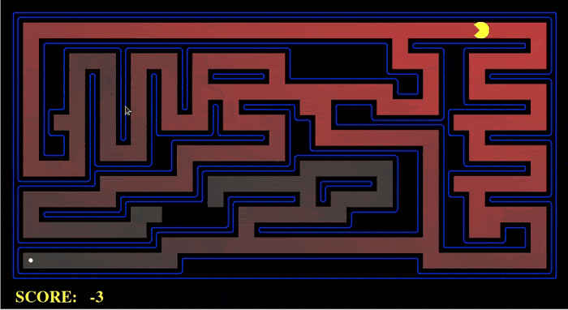
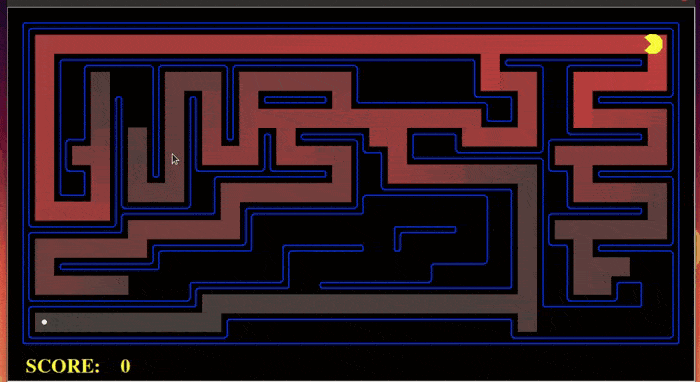
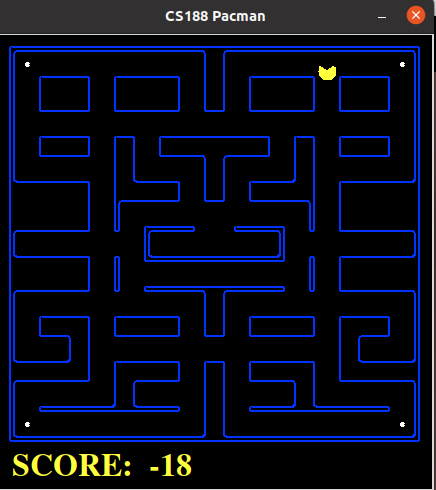
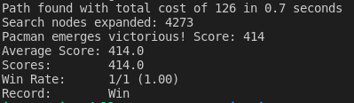
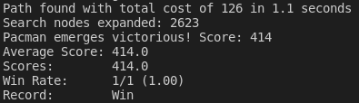
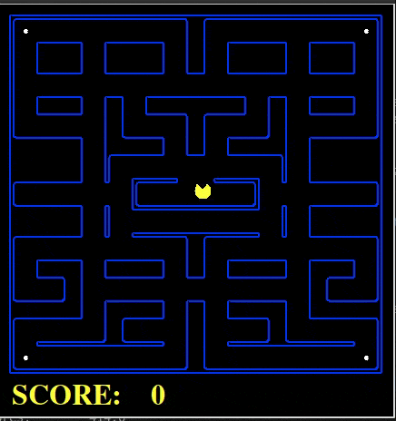
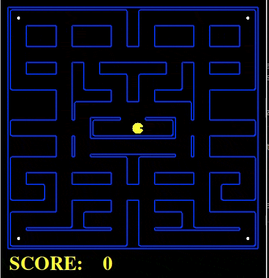

# Algoritmos de Búsqueda en Pacman
## Seminario II - Inteligencia Artificial en Agentes Autónomos
### Autor    : Juan Pablo Sánchez - 201630002-3
### Profesor : Mauricio Araya 

El objetivo de esta tarea involucra la implementación de algoritmos de búsquedad sobre un agente Pacman desarrollado para el curso [CS188 de la Universidad de Berkeley](https://inst.eecs.berkeley.edu/~cs188/sp21/project1/). Los archivos base para el desarrollo de este proyecto pueden ser descargados desde el siguiente [enlace](https://inst.eecs.berkeley.edu/~cs188/sp21/assets/files/search.zip).

# Tabla de Contenidos
1. [Objetivos](#id0)
2. [Getting started](#id1)
3. [Problema : Encontrar comida en un punto fijo del mapa](#id2)
    * [Depth-First Search](#id2.1) 
    * [Breath-First Search](#id2.2)
    * [A* Search](#id2.3)
4. [Problema : Encontrar las esquinas del mapa](#id3)
5. [Problema : Heuristica para encontrar las esquinas mapa](#id4)

# Objetivos <div id="id0"></div>

- Desarrolle o adapte una solución de los 3 primeros ejercicios.
- Desarrolle uno o toos los ejercicios del 4 al 7.
- Proponga una modificación:
    - Al ambiente u objetivo del agente.
    - A la heuristica utilizada para la búsqueda.
    - A los algoritmos propuestos.
- Comente su código adecuadamente.
- Genere un video explicativo de 5 minutos explicando su modificación y mostrando los resultados.
- Suba su código y reporte a [aula](aula.usm.cl). Debe incluir un link donde pueda visualizarse su video.

# Getting Started <div id="id1"></div>

El proyecto utiliza Python en una versión superior a 3.0. Esta implementación en particular fue desarrollada en Python 3.8.10.

1. Clonar el repositorio
~~~~
git clone git@github.com:BarronStack/AgentesTarea1.git
~~~~

2. Iniciar un juego interactivo Pacman. Utiliza las teclas WASD o las flechas el teclado para controlar Pacman.
~~~~
python3 pacman.py
~~~~

3. Utilizar un agente de búsqueda simple con el que resolver de manera eficiente el problema.
~~~~
python3 pacman.py --layout tinyMaze --pacman GoWestAgent
~~~~

La situación permite resolver diferentes problemas mediante el uso y llamado de diferentes agentes de búsqueda. A continuación se profundizará en distintos algoritmos que pueden utilizarse para resolver casos en el problema de Pacman.

# Problema : Encontrar comida en un punto fijo del mapa <div id="id2"></div>

A continuación se presentan las implementaciones de los algoritmos de búsqueda *DFS*, *BFS* y*A* * realizadas en el archivo `search.py` el cuál almacena los algoritmos a ser utilizados por los agentes de búsqueda en el archivo `searchAgents.py`. 

El objetivo es desarrollar los algoritmos de tal forma que permitan al agente encontrar una ruta oṕtima al punto donde se encuentra la comida dentro del laberinto. Estos algoritmos serán utilizados posteriormente por los agentes de búsqueda a implementar en la sección del problema de la búsqueda de las esquinas del laberinto.

Los algoritmos en general reciben como entrada el problema, el cual a su vez almacena:
- El estado inicial.
- El estado objetivo.
- La función para expandir el camino (determinarndo posibles rutas, acciones y costos).

Puntualmente, el algoritmo `aStarSearch()` tiene como entrada la heuristica a utilizar dentro del cálculo de los costos.

Los algoritmos retornan como salida la serie de `acciones` o `movimientos` calculados que debe realizar el agente para llegar al punto objetivo. 

# Depth-First Search <div id="id2.1"></div>

El algoritmo DFS (Búsqueda en profundidad) es un tipo de algoritmo de búsqueda no informada utilizado para recorrer los posibles nodos de un grafo o árbol. Funciona expandiendo todos los caminos o ramas que va encontrando. Una vez finaliza su exploración en cierto camino, regresa a un nodo anterior y repite el mismo proceso por otro camino no explorado. 

Si bien, este algoritmo explora completamente los caminos posibles no implica ser el oṕtimo en términos de costos o tiempo de ejecución. 
 

```python
def depthFirstSearch(problem):    
    print("Start:", problem.getStartState())
    print("Is the start a goal?", problem.isGoalState(problem.getStartState()))

    # Se define el nodo inicial desde donde se comenzará a explorar el laberinto.
    # Este nodo incluye el estado actual (coordenadas x,y) y las acciones a realizar.
    # Al no ser expandido todavía, se desconocen las acciones a realizar.
    node = {"state":problem.getStartState(),"actions":[]}
    
    # Se utiliza un Stack para aplicar una politica LIFO al ingresar y remover nodos.
    frontier = util.Stack()
    frontier.push(node)

    explored = []

    # Se repite el proceso mientras existan posibles caminos a explorar.
    while not frontier.isEmpty():
        
        # Se adquiere el primer nodo en la frontera y se comprueba si no ha sido explorado/expandido.
        # De no ser explorado todavía se expande chequeando primero si corresponde la punto objetivo.
        
        node = frontier.pop()
        currentState = node["state"]
        actionsState = node["actions"]

        if currentState not in explored:
            explored.append(currentState)
        
            if problem.isGoalState(currentState):
                return actionsState

            else:
                # Se expande el nodo con sus posibles caminos, definiendo los estados y acciones para llegar a cada uno de ellos agregandolos a nuestra frontera.
                # Una vez hecho esto, se irá explorando en orden a partir del primer nodo que se encuentre repitiendo el proceso hasta que no pueda expandirse más.

                successors = problem.expand(currentState)
                for successor in successors:
                    newActionState = actionsState + [successor[1]]

                    # Se almacena las coordenadas del nuevo estado y las acciones para llegar al este.
                    newNode = {"state":successor[0],"actions":newActionState}
                    frontier.push(newNode)
    

    # Se retorna la serie de acciones que debe realizar el agente para arribar al objetivo por una ruta. No necesariamente será la ruta oṕtima. 
    return actionsState
```

### Ejecución del algoritmo.

Para comprobar la implementación del algoritmo DFS en el problema, se pueden usar los siguientes comandos para ejecutar Pacman con un `searchAgent` que utilice el algoritmo en 3 casos de laberintos predefinidos.

~~~~
python3 pacman.py -l tinyMaze -p SearchAgent -a fn=dfs
~~~~

~~~~
python3 pacman.py -l mediumMaze -p SearchAgent -a fn=dfs
~~~~

~~~~
python3 pacman.py -l bigMaze -z .5 -p SearchAgent -a fn=dfs
~~~~


<p align="center">
 <figcaption align="center">Ejecución de DFS con mediumMaze</figcaption>
</p>

# Breath-First Search <div id="id2.2"></div>

El algoritmo BFS (Búsqueda en anchura) es un tipo de algoritmo de búsqueda no informada utilizado para recorrer los posibles nodos de un grafo o árbol. Funciona expandiendo y explorando los nodos adyacentes a la posición de forma recursiva así recorriendo todos los vecinos sucesivamente hasta completar la búsqueda. 

En este algoritmo, cada búsqueda tendrá un costo asociado con el que se dará prioridad a que nodos vecinos ir explorando. Si bien este algoritmo puede entregar una solución oṕtima, la velocidad con la que obtenga la solución dependerá de la complejidad y los costos de la estructura a explorar.

```Python
def breadthFirstSearch(problem):
    print("Start:", problem.getStartState())
    print("Is the start a goal?", problem.isGoalState(problem.getStartState()))    
    
    # Se define el nodo inicial desde donde se comenzará a explorar el laberinto.
    # Este nodo incluye el estado actual (coordenadas x,y),las acciones a realizar y se le asigna un costo.
    # Al no ser expandido todavía, se desconocen las acciones a realizar.
    node = {"state":problem.getStartState(),"actions":[],"cost":0}
    
    # Se utiliza un Queue para aplicar una politica FIFO al ingresar y remover nodos.
    frontier = util.Queue()
    frontier.push(node)

    explored = [] 

    # Se repite el proceso mientras existan posibles caminos a explorar.
    while not frontier.isEmpty():
        
        # Se adquiere el primer nodo en la frontera y se comprueba si no ha sido explorado/expandido.
        # De no ser explorado todavía se expande chequeando primero si corresponde la punto objetivo.
        
        node = frontier.pop()
        currentState = node["state"]
        actionsState = node["actions"]
        costState    = node["cost"]

        if currentState not in explored:
            explored.append(currentState)
        
            if problem.isGoalState(currentState):
                return actionsState

            else:
                # Se expande el nodo con sus posibles caminos, definiendo los estados, acciones y costos para llegar a cada uno de ellos agregandolos a nuestra frontera.
                # Se incorpora un costo asociado a la acción que debo realizar para llegar al nuevo nodo.
                # Teniendo los costos asociados, se puede expandir primero la ruta adyancente que tenga un menor costo de exploración. 
                successors = problem.expand(currentState)
                for successor in successors:
                    newActionState = actionsState + [successor[1]]
                    newCostState   = costState + successor[2]
                    
                    # Se almacena las coordenadas del nuevo estado, las acciones y el costo asociado a las acciones para llegar a este.
                    newNode = {"state":successor[0],"actions":newActionState,"cost":newCostState}
                    frontier.push(newNode)  
    
    # Se retorna la serie de acciones que debe realizar el agente para arribar al objetivo por una ruta.
    return actionsState
```
### Ejecución del algoritmo.

Para comprobar la implementación del algoritmo BFS en el problema,  se pueden usar los siguientes comandos para ejecutar Pacman con un `searchAgent` que utilice el algoritmo en 3 casos de laberintos predefinidos.

~~~~
python3 pacman.py -l tinyMaze -p SearchAgent -a fn=bfs
~~~~

~~~~
python3 pacman.py -l mediumMaze -p SearchAgent -a fn=bfs
~~~~

~~~~
python3 pacman.py -l bigMaze -z .5 -p SearchAgent -a fn=bfs
~~~~

<p align="center">
 <figcaption align="center">Ejecución de BFS con mediumMaze</figcaption>
</p>

# A* Search <div id="id2.3"></div>

El algoritmo A* (Búsqueda A estrella) es un tipo de algoritmo de búsqueda informada utilizada para la búsqueda en gráfos. Este algoritmo es capaz de encontrar un camino oṕtimo de menor costos siempre y cuando el ámbiente cumpla con determinadas condiciones para funcionar. 


Al algoritmo utiliza una funcioń $f(n) = g(n) + h(n)$ donde se representa meiante $g(n)$ el costo real del camino recorrido para llegar al nodo y $h(n)$ un valor heurístico que evalua el costo "teoríco" desde el nodo hasta el objetivo. 

Utilizano 2 estructuras, una cola de prioridad ordenada por los costos $f(n)$ de cada nodo y otra con los nodos explorados. En cada iteración se expande el primer nodo de la cola, de no ser el objetivo, se expande el nodo calculando $f(n)$ para sus nodos hijo incluyendolos en la cola mientras el nodo actual se considera explorado, repitiendo el proceso hasta encontrar la ruta más corta al objetivo. 

El algoritmo A* puede considerarse una combinación de búsquedas en anchura y en profundidad debido al costo real y al heuristico. Esto permite cambiar el camino a explorar si se encuentran rutas prometedoras. 

```Python
def aStarSearch(problem, heuristic=nullHeuristic):  
    print("Start:", problem.getStartState())
    print("Is the start a goal?", problem.isGoalState(problem.getStartState()))

    # Se define el nodo inicial desde donde se comenzará a explorar el laberinto.
    # Este nodo incluye el estado actual (coordenadas x,y),las acciones a realizar y se le asigna un costo.
    # Al no ser expandido todavía, se desconocen las acciones a realizar.
    node = {"state":problem.getStartState(),"actions":[],"cost":0}

    # Se utiliza una PriorityQueue para aplicar una politica de búsqueda según prioridad definida por el cálculo de la heuristica.
    frontier = util.PriorityQueue()
    frontier.push(node, 0)

    explored = [] 

    # Se repite el proceso mientras existan posibles caminos a explorar.
    while not frontier.isEmpty():
        
        # Se adquiere el primer nodo en la frontera y se comprueba si no ha sido explorado/expandido.
        # De no ser explorado todavía se expande chequeando primero si corresponde la punto objetivo.
        

        node = frontier.pop()
        currentState = node["state"]
        actionsState = node["actions"]
        costState    = node["cost"]

        explored.append((currentState, costState))

        if problem.isGoalState(currentState):
            return actionsState

        else:
            # Se expande el nodo con sus posibles caminos, definiendo los estados, acciones y costos para llegar a cada uno de ellos agregandolos a nuestra frontera.

            successors = problem.expand(currentState)
            for successor in successors:
                newCurrentState = successor[0]
                newActionState  = actionsState + [successor[1]]
                newCostState    = problem.getCostOfActionSequence(newActionState)

                # En este instante se define el nuevo nodo a explorar con el costo asociado a la ruta pero está pendiente comprobar si ya fue explorado y definir la prioridad que tendrá según el cálculo de la heuristica.

                newNode = {"state":newCurrentState,"actions":newActionState,"cost":newCostState}

                # Se comprueba si el siguiente nodo futuro ya ha sido explorado anteriormente o no 
                visited = False
                for exploredNode in explored:
                    exploredState, exploredCost = exploredNode

                    if (exploredState == newCurrentState) and (exploredCost <= newCostState):
                        visited = True

                # En caso de no ser explorado se puede considerar en la ruta futura. Por lo que se almacena su información más una prioridad h() definida el cálculo de la heuristica que define cuanto es el costo faltante para llegar al destino. Así el algoritmo puede identificar y explorar los nodos más cercanos al objetivo. 
                if not visited:
                    newPriority = newCostState + heuristic(newCurrentState,problem)

                    frontier.push(newNode,newPriority)
                    explored.append((newCurrentState,newCostState))

    # Se retorna la serie de acciones que debe realizar el agente para arribar al objetivo por una ruta.
    return actionsState
```

### Ejecución del algoritmo.

Para comprobar la implementación del algoritmo A* en el problema, se puede utilizar el siguiente comando para ejecutar Pacman con un `searchAgent` que utilice el algoritmo y haga uso de una heuristica trivial para determinar los costos.

~~~~
python3 pacman.py -l bigMaze -z .5 -p SearchAgent -a fn=astar
~~~~

Para la solución oṕtima, se pueden utilizar los siguientes comandos para ejecutar Pacman con un `searchAgent` que utilice el algoritmo y haga uso de una heuristica a base de la distancia de manhattan para calcular los costos en 3 casos de laberintos predefinidos.

~~~~
python3 pacman.py -l tinyMaze -p SearchAgent -a fn=astar,heuristic=manhattanHeuristic
~~~~

~~~~
python3 pacman.py -l mediumMaze -p SearchAgent -a fn=astar,heuristic=manhattanHeuristic
~~~~

~~~~
python pacman.py -l bigMaze -z .5 -p SearchAgent -a fn=astar,heuristic=manhattanHeuristic
~~~~

<p align="center">
 <figcaption align="center">Ejecución de A* con mediumMaze</figcaption>
</p>

# Problema : Encontrar las esquinas del mapa <div id="id3"></div>

El objetivo de este punto es implementar un agente de búsqueda en `searchAgent.py` de forma que sea capaz de calcular una ruta oṕtima tal que le permita encontrar las 4 esquinas del laberinto.

A continuación se muestra la implementación del código realizado para las funciones `__init__()`, `getStartState()`, `isGoalState()`, `expand()` dentro de la clase `CornersProblem` en el archivo `searchAgent.py`.

En primera instancia, se completa la función que inicializa el problema de las esquinas de modo que incluya en el nodo, el estado de las esquinas para determinar si alguna(s) ha(n) sido explorada(s). 

```Python
    def __init__(self, startingGameState):
        """
        Stores the walls, pacman's starting position and corners.
        """
        self.walls = startingGameState.getWalls()
        self.startingPosition = startingGameState.getPacmanPosition()
        top, right = self.walls.height-2, self.walls.width-2
        self.corners = ((1,1), (1,top), (right, 1), (right, top))
        for corner in self.corners:
            if not startingGameState.hasFood(*corner):
                print('Warning: no food in corner ' + str(corner))
        
         # DO NOT CHANGE; Number of search nodes expanded
        self._expanded = 0
        
        # Listas que almacena el estado de las esquinas. True si fueron exploradas, False si no se han explorado.
        # Se procede a chequear si el punto inicial corresponde a alguna de las esquinas del mapa. 
        corners = [False,False,False,False]
        if self.startingPosition == self.corners[0]:
            corners[0] = True
        
        if self.startingPosition == self.corners[1]:
            corners[1] = True
        
        if self.startingPosition == self.corners[2]:
            corners[2] = True
        
        if self.startingPosition == self.corners[3]:
            corners[3] = True

        self.startingState = (self.startingPosition,corners)
```

Se completan las funciones más triviales `getStartState()` y `isGoalState()` que entregan la información de la posición inicial del nodo y si la posición actual es el objetivo el cual implica un movimiento donde se hayan logrado explorar todas las esquinas. 

```Python
    def getStartState(self):
        """
        Returns the start state (in your state space, not the full Pacman state
        space)
        """
        return self.startingState        

    def isGoalState(self, state):
        """
        Returns whether this search state is a goal state of the problem.
        """
        visited = state[1]

        if visited[0] and visited[1] and visited[2] and visited[3]:
            return True
        else:
            return False
```

En tercera instancia, se implementa la función `expand()` que entrega todos los posibles movimientos que puede realizar el nodo actual. Esta entrega los siguientes estados (coordenadas) que puede tener el nodo actual junto con el estado de las esquinas que pueden tener, dicho proceso se basa en la misma lógica implementada en la función init(). 

```Python
def expand(self, state):
        """
        Returns child states, the actions they require, and a cost of 1.

         As noted in search.py:
            For a given state, this should return a list of triples, (child,
            action, stepCost), where 'child' is a child to the current
            state, 'action' is the action required to get there, and 'stepCost'
            is the incremental cost of expanding to that child
        """

        successors = []

        for action in self.getActions(state):
            nextState = self.getNextState(state,action)
            #print(nextState)

            ## Debo chequear si el nuevo punto corresponde a alguna de las esquinas. 
            corners = list(state[1])

            if nextState == self.corners[0]:
                corners[0] = True
        
            if nextState == self.corners[1]:
                corners[1] = True
        
            if nextState == self.corners[2]:
                corners[2] = True
        
            if nextState == self.corners[3]:
                corners[3] = True

            costState = self.getActionCost(state, action, nextState)
            successors.append(((nextState,tuple(corners)),action, costState,))

        self._expanded += 1 # DO NOT CHANGE
        return successors
```

### Ejecución del problema.

Para comprobar el funcionamiento del problema de encontrar las esquinas se pueden ejecutar los siguientes comandos para poder testear funcionamiento en 3 ambientes de laberintos predefinidos.

~~~~
python3 pacman.py -l tinyCorners -p SearchAgent -a fn=bfs,prob=CornersProblem
~~~~

~~~~
python3 pacman.py -l mediumCorners -p SearchAgent -a fn=bfs,prob=CornersProblem
~~~~

~~~~
python3 pacman.py -l bigCorners -p SearchAgent -a fn=bfs,prob=CornersProblem
~~~~

### Modificación al problema

Para este problema, se realizaron modificaciónes en el ambiente de ejecución creando un nuevo laberinto *originalCorners* basado en el laberinto original de Pacman con el cual poder probar su funcionamiento. Esto debido a que la problemática forma base para la resolución con la heuristica del problema a continuación.

<p align="center">
 
</p>

En este caso, el agente comienza en el centro del laberinto en la posición original de los fantasmas del juego, mientras que los objetivos se encuentran en las esquinas del mapa, cuyas coordenadas dependen de las dimensiones del esquema. Para poder ejecutar tal situación, se debe utilizar el siguiente comando:

~~~~
python3 pacman.py -l originalCorners -z .5 -p SearchAgent -a fn=bfs,prob=CornersProblem
~~~~

Una vez ejecutado se obtienen los siguientes resultados para la problemática ejecutada en un nuevo ambiente de laberinto.

<p align="center">
 
</p>

Dichos resultados se intentarán comparar a continuación con la implementación del problema de una heuristica que permita encontrar las esquinas del mapa utilizando el algoritmo A* y la heuristica definida.

# Problema : Heuristica para encontrar las esquinas mapa <div id="id2.4"></div> 

El problema a continuación se basa en el caso anterior de poder encontrar, dado un laberinto, todas las esquinas del problema con una ruta oṕtima e idealmente con mejores resultaos que los obtenidos anteriormente. Además al tratarse de una heurística se posee cierta libertad en elegir la solución.

Al revisar la literatura y documentaciones del problema, existen distintos planteamientos del problema para definir tal $h(n)$ mediante el uso de:
- Distancia manhattan.
- Distancia euclideana.
- Distancia trivial 0.
- La suma de las distancias entre las esquinas y el nodo. 

Para esta situación se busca implementar una heuristica tal que defina un $h(n)$ a partir de la relación entre la distancia entre el punto actual - esquina más lejana y entre el punto actual - esquina más cercana.

Primero se define la función  `closestCorner()` que a partir de las coordenadas de las 4 esquinas que retorna la esquina más cercana a la posición del agente y la distancia entre ellos.

```Python 
### Búsqueda del mínimo entre la distancia de todas las esquinas con el punto actual
def closestCorner(state, corners):
    # Define el valor inical con el que comparar
    closeCorner = 0
    closeCornerCost = util.manhattanDistance(state,corners[0])

    # Explora todas las esquinas calculando la distancia esquina-punto
    for i in range(len(corners)):
        cornerLocation = corners[i]
        distanceToCorner = util.manhattanDistance(state,cornerLocation)

        # Obtiene el mínimo de ellas 
        if distanceToCorner <= closeCornerCost: 
            closeCorner = i
            closeCornerCost = distanceToCorner

    return (closeCorner,closeCornerCost)
```

A continuación se define la función `closestCorner()` que a partir de las coordenadas de las 4 esquinas que retorna la esquina más lejana a la posición del agente y la distancia entre ellos.

```Python
### Búsqueda del máximo entre la distancia de todas las esquinas con el punto actual
def farthestCorner(state, corners):
    # Define el valor inical con el que comparar
    farCorner = 0
    farCornerCost = util.manhattanDistance(state,corners[0])
    
    # Explora todas las esquinas calculando la distancia esquina-punto
    for i in range(len(corners)):
        cornerLocation = corners[i]
        distanceToCorner = util.manhattanDistance(state,cornerLocation)

        # Obtiene el máximo de ellas 
        if distanceToCorner >= farCornerCost: 
            farCorner = i
            farCornerCost = distanceToCorner
    
    return ((farCorner,farCornerCost))
```

Con lo anterior, es posible definir una heuristica tal que, calcule el valor $h(n) = d_{n,1} + d_{1,2}$ donde:
- $d_{n,1}$ = Distancia entre el nodo *n* y la esquina *1* más cercana
- $d_{1,2}$ = Distancia entre la esquina *1* más cercana y la esquina *2* más lejana del nodo *n*.

```Python
def cornersHeuristic(state, problem):
    """
    A heuristic for the CornersProblem that you defined.

      state:   The current search state
               (a data structure you chose in your search problem)

      problem: The CornersProblem instance for this layout.

    This function should always return a number that is a lower bound on the
    shortest path from the state to a goal of the problem; i.e.  it should be
    admissible (as well as consistent).
    """

    # These are the corner coordinates
    # These are the walls of the maze, as a Grid (game.py)
    corners = problem.corners 
    walls   = problem.walls 

    heuristic = 0

    currentState   = state[0]
    currentCorners = state[1]

    # Almacena las coordenadas de las esquinas no visitadas en una lista
    unvisitedCorners = []
    for i in range(len(currentCorners)):
        if not currentCorners[i]:
            unvisitedCorners.append(corners[i])

    # Se aplica si hay esquinas que no han sido visitadas todavía
    if len(unvisitedCorners) > 0:
        closest,closestDistance = closestCorner(currentState, unvisitedCorners)
        farthest,farthestDistance = farthestCorner(currentState, unvisitedCorners)

        # Para determinar con que esquina y distancia está comparando
        #print("Esquina cercana :",closest,closestDistance)
        #print("Esquina lejana  :",farthest,farthestDistance)

        # Teniendo las posiciones de las esquinas lejanas y cercanas, se calcula la distancia entre ellas
        closestCornerState = unvisitedCorners[closest]
        farthestCornerState = unvisitedCorners[farthest]
        farthestDistance = util.manhattanDistance(closestCornerState,farthestCornerState)

        # La heuristica a aplicar corresponde a la suma entre la distancia del nodo a la esquina más cercana y la distancia entre la esquina más cercana con la más lejana.
        heuristic = closestDistance + farthestDistance
    return heuristic
```

### Modificación del problema.

La solución a este problema se aplica la modificación anterior cambiando el ambiente de ejecución para funcionar sobre un nuevo laberinto llamado *originalCorners*. Además, la heuristica en vez de utilizar la solución mediante la distancia manhattan, se implementa este nuevo proceso para obtener los valores heuristicos. 

Para poder ejecutar tal situación, se debe utilizar el siguiente comando:

~~~~
python3 pacman.py -l originalCorners -z .5 -p AStarCornersAgent
~~~~

Alternativamente, se puede ejecutar el siguiente comando que es equivalente al anterior pero más detallado en sus opciones:
~~~~
python3 pacman.py -l originalCorners -z .5 -p SearchAgent -a fn=aStarSearch,prob=CornersProblem,heuristic=cornersHeuristic
~~~~ 

Una vez ejecutado se obtienen los siguientes resultados para la problemática ejecutada en un nuevo ambiente de laberinto.

<p align="center">
 
</p>

Al comparar con la solución previa en el problema de encontrar las esquinas sin utilizar una heuristica, se puede ver con claridad una mejora en el número de nodos expandidos. Esto producto de la heuristica aplicada donde el problema de las esquinas con heuristica expande 2623 nodos mientras que el problema de encontrar las esquinas sin heuristica expande hasta 4273 nodos. Ambos con un mismo coste predictivo y un puntaje promedio igual producto que logran encontrar las 4 esquinas.

<table align="center"><tr>
<td> <figcaption align="center">Corners Problem</figcaption>
</td>
<td> <figcaption align="center">Corners Heuristic</figcaption>
</td>
</tr></table>


